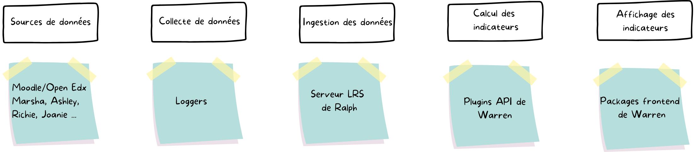

---
# You can also start simply with 'default'
theme: seriph
# random image from a curated Unsplash collection by Anthony
# like them? see https://unsplash.com/collections/94734566/slidev
# background:
# some information about your slides (markdown enabled)
title: Les tableaux de bord pédagogiques chez FUN
author: Quitterie Lucas & Alexandra Oudot (FUN)
# info: 
# apply unocss classes to the current slide
class: text-center
# https://sli.dev/features/drawing
drawings:
  persist: false
# slide transition: https://sli.dev/guide/animations.html#slide-transitions
transition: slide-left
# enable MDC Syntax: https://sli.dev/features/mdc
mdc: true
# take snapshot for each slide in the overview
overviewSnapshots: true
colorSchema: light
---

# Les tableaux de bord pédagogiques chez FUN

Les indicateurs existants

<div class="abs-br m-6 flex gap-2">
  <a href="https://github.com/slidevjs/slidev" target="_blank" alt="GitHub" title="Open in GitHub"
    class="text-xl slidev-icon-btn opacity-50 !border-none !hover:text-white">
    <carbon-logo-github />
  </a>
</div>

<div class="author">
  Quitterie Lucas & Alexandra Oudot (FUN) | Les Quartiers du Numérique | 11 octobre 2024
</div>

---
transition: fade-out
layout: center
---

# Pourquoi construire des tableaux de bord ?

1. Répondre à une demande accrue de suivi des cours en ligne
2. Acquérir des insights précis sur l'activité des cours et leur suivi
3. Permettre à toutes les parties prenantes de monitorer et de prendre des décisions
   informées sur les cours.
4. Aligner les actions sur les objectifs spécifiques de chaque acteur dans
   l'apprentissage en ligne
5. Maximiser la réussite et l'efficacité de l'apprentissage en ligne

<!-- Objectif: Présenter les indicateurs que FUN propose aujourd'hui dans ses différentes
activités

1. Pourquoi FUN propose ces indicateurs là ?
Car ils répondent au besoin des utilisateurs de la plateforme

2. Pourquoi répondent-ils au besoin des utilisateurs ? 
Car les utilisateurs veulent connaître ses informations sur l'activité des cours

3. Pourquoi les utilisateurs veulent connaitre des infos sur l'activité des
   cours ? 
    a. Car en tant qu'apprenant, on veut savoir où on en est
    b. Car en tant qu'enseignant, on veut savoir ce qu'apprennent et comment ils
apprennent
    c. Car en tant qu'équipe pédagogique, on veut savoir comment réagissent les
apprenants face au contenu proposé pour dispenser le cours
    d. Car en tant qu'administrateur, on veut savoir l'efficacité des cours dispensés
par l'établissement

4.a. Pourquoi l'apprenant veut savoir où il en est ? 
Pour orienter ses efforts, avoir confiance en lui dans sa réussite, planifier
son travail
4.b. Pour savoir si son contenu est de bonne qualité et est adapté pour le cours
4.c. Pour savoir si le cours a été bien construit
4.d. Pour savoir si le cours est utile et la stratégie de diffusion est bonne

5. Pourquoi veulent-ils ça ? 
Pour réussir la mission de l'apprentissage en ligne
a. réussir son cours
b. transmettre son savoir
c. assurer la bonne transmission du cours
d. dispenser des cours de qualité

 -->

---
transition: fade-out
layout: image
image: ./cycle-vie.png
backgroundSize: 80%
---

---
transition: fade-out
layout: image
image: ./domaines.png
backgroundSize: 45%
---

---
transition: fade-out
layout: image
image: ./metiers.png
backgroundSize: 45%
---

---
transition: fade-out
layout: section
---

# 🏭
# Construire l'outil de learning analytics de FUN

---
transition: fade-out
layout: default
---

## Étapes clés pour la mise en place des tableaux de bord



## Avantages des choix techniques

* Interopérabilité et standardisation
* Collecte et analyse en temps réel
* Flexibilité et évolutivité

---
transition: fade-out
layout: section
---

# 📈
# Calculer et définir les indicateurs pédagogiques

---
transition: fade-out
layout: default
---

## Indicateurs par ressource pédagogique

Distribués par le projet [Warren](https://github.com/openfun/warren)

Exemple du plugin video

1. **[Plugin Python](https://pypi.org/project/warren-video/) pour le calcul des indicateurs**

```bash
$ pip install warren-video
$ warren indicator list

> warren_video.indicators:DailyCompletedViews
> warren_video.indicators:DailyDownloads
> warren_video.indicators:DailyUniqueCompletedViews
> warren_video.indicators:DailyUniqueDownloads
> warren_video.indicators:DailyUniqueViews
> warren_video.indicators:DailyViews
```
<br>

2. **[Package NPM](https://www.npmjs.com/package/@openfun/warren-video) pour les visualisations des indicateurs**

```bash
$ npm i @openfun/warren-video
```
---
transition: fade-out
layout: image
image: ./tdbp-video.png
backgroundSize: 80%
---

## Tableau de bord vidéo (V1)

---
transition: fade-out
layout: default
---

## Créez vos tableaux de bord avec Warren ! 

Exemple du [projet TdbP](https://github.com/apui-avignon-university/warren-tdbp) impulsé par l'Université d'Avignon

* Projet hébergé dans un repository Github dédié
* Utilisation des images Docker `core` de Warren (`api` pour créer les
  indicateurs et `app` pour créer les dataviz)
* Développement d'un plugin dédié

<br>

```bash
$ warren indicator list

> warren_tdbp.indicators:SlidingWindowIndicator
> warren_tdbp.indicators:CohortIndicator
> warren_tdbp.indicators:ScoresIndicator
> warren_tdbp.indicators:GradesIndicator
```

---
transition: fade-out
layout: image
image: ./vue-eleve-tdbp.png
backgroundSize: 90%
---

## Vue élève

---
transition: fade-out
layout: image
image: ./vue-enseignant-tdbp.png
backgroundSize: 80%
---

## Vue enseignant

---
transition: fade-out
layout: section
---

# 💬
# Récolter les besoins utilisateurs

---
transition: fade-out
layout: center
---

## A vous ! ✏️

*Lors de cet atelier, vous allez concevoir tous ensemble un tableau de bord.*

---
transition: fade-out
layout: center
---

* A quoi servent les tableaux de bord pédagogiques dans votre métier ? 

* Quels indicateurs répondent aux objectifs liés à votre métier ?

* Quelles ressources pédagogiques sont utiles à observer, selon vous ?

---
transition: fade-out
layout: center
---

<div class="grid grid-cols-1 gap-3 credits">
  <div style="text-align: center;">
    <a href="https://miro.com/app/board/uXjVLTWBVLU=/?share_link_id=960986370764">
      👇 Scannez le QR ci-dessous pour accéder au tableau Miro de l'atelier 👇
    </a>
    <br/>
    
  </div>
</div>

<style>
.credits {
  margin-top: 1rem;
  text-align: center;
}
.centered-image {
  display: block;
  margin: 1rem auto; /* Marges automatiques pour centrer horizontalement */
}
</style>

---
transition: fade-out
layout: end
---

# 🙏 

# Merci et à bientôt !

<br>

👇 *Scannez les QR codes ci-dessous pour retrouver les slides* 👇

<br>

<div class="grid grid-cols-1 gap-3 credits">
  <div style="text-align: center;">
    <a href="https://openfun.github.io/2024-quartier-numerique-tdbp/">
    </a>
    <br/>
    
  </div>
</div>

<style>
.credits {
  margin-top: 1rem;
  text-align: center;
}
.centered-image {
  display: block;
  margin: 1rem auto; /* Marges automatiques pour centrer horizontalement */
}
</style>